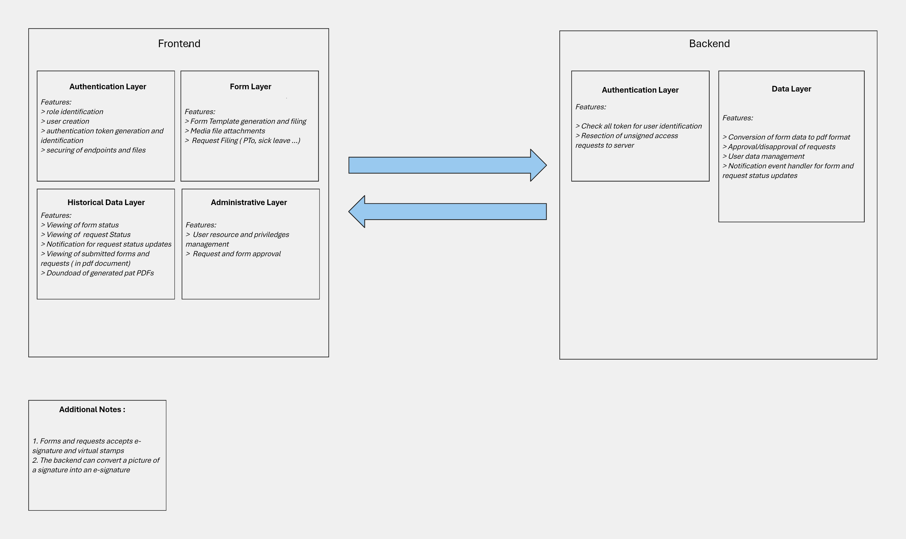
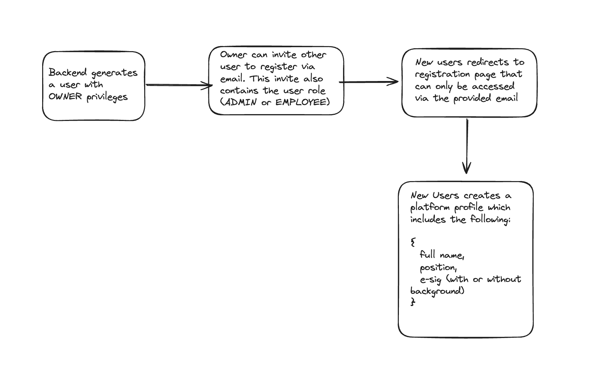
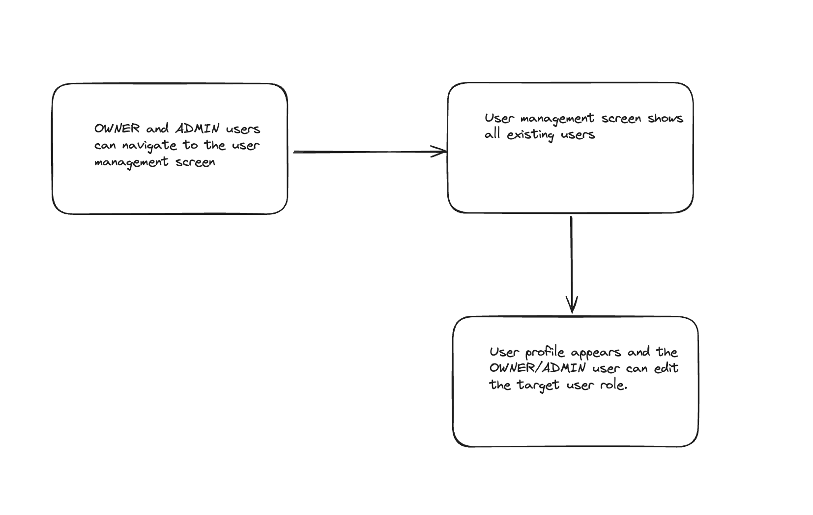
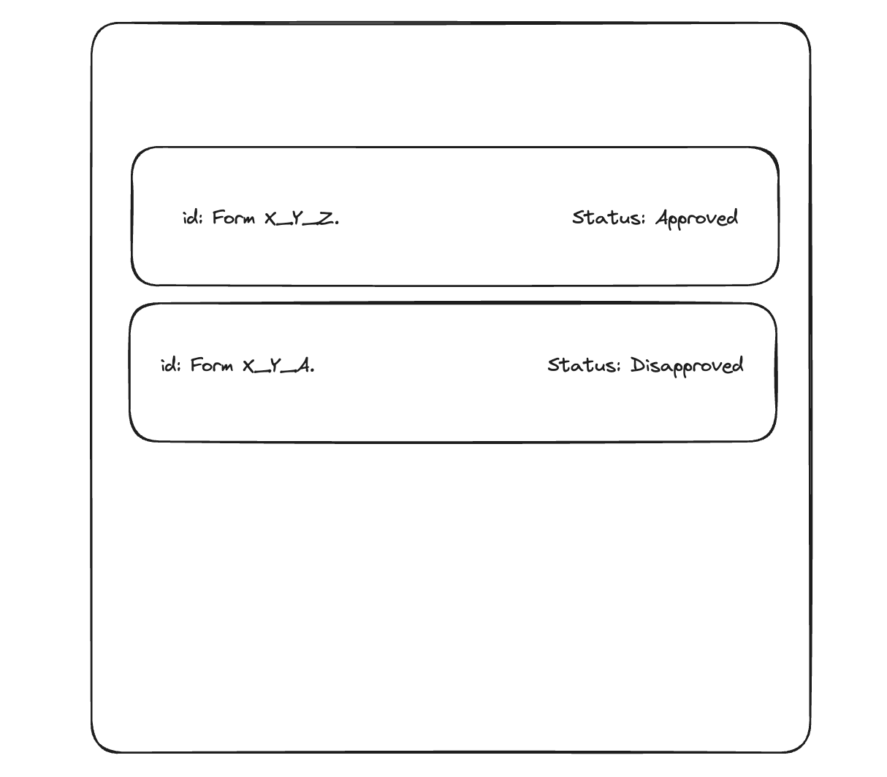
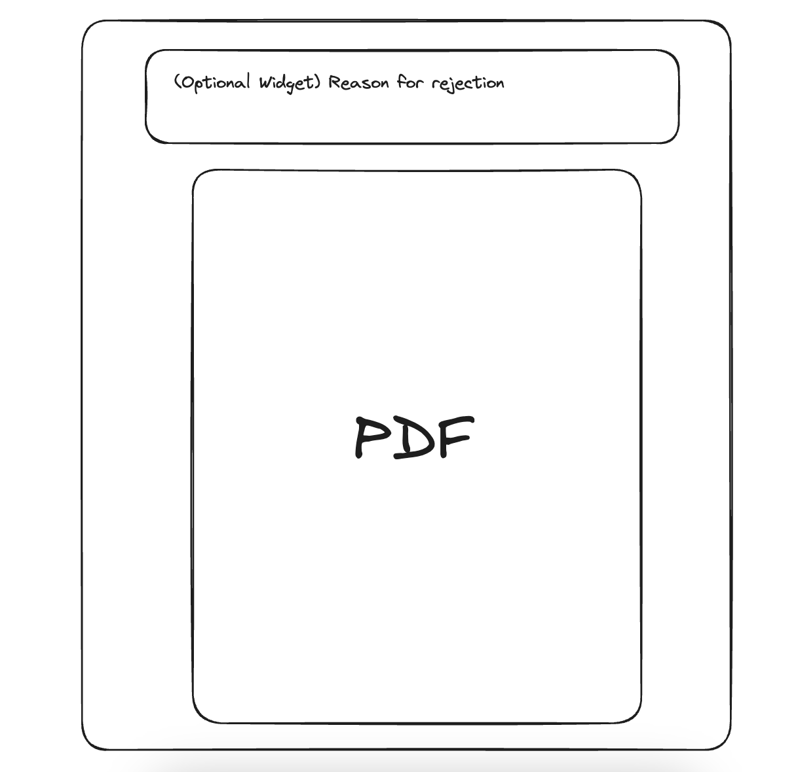

# Enterprise Resource Planning Software 

A software system designed for streamline and integrate the key processes of an organization. This centralized platform will handle the report filing and human resources tasks. 

# Table of Contents 

1. [General System Design](#general-system-design)   
2. [Frontend](#frontend)   
    * [Authentication Layer](#authentication-layer)   
        * [Roles](#roles)   
        * [Authentication Layer flow](#authentication-layer-flow)
            * [User Creation](#user-creation)
            * [User Role](#user-role-update)
    * [Form Layer](#form-layer)
    * [Historical view Layer](#hisotrical-data-view-layer)
        * [Summarized view](#1-summarized-view)
        * [Expanded View](#2-expanded-view)
        * [Notification View](#3-notification-view)
    * [Admin Layer](#admin-layer)
        * [User Management](#user-management)
        * [Request And report Form Approval](#request-and-report-form-approval)
3. [Backend](#backend)
    * [Authorization Layer](#authorization-layer-backend)
    * [Data Layer](#data-layer)
        * [Report Generation](#report-and-request-conversions-to-pdf)
        * [Approval and Disapproval of Requests](#approval-and-disapproval-of-requests)
4. [Timeline and Milestones](#timeline-and-expected-milestones)

# General System Design 



The system is composed of two main parts - the frontend and the backend. The frontend is dedicated for the client facing software which can be accessed using a browser. On the otherhand, the backend is dedicated for the processing, storage, and management of all acquired data and is designed to run locally or on a cloud server. 

# Frontend 

The frontend is composed of four sub-layers - authentication, form, historical data, and administrative layers. The authentication layer handles the user and security related tasks. The form layer handles all report forms and HR related request forms. Historical data layer on the other hand handles the presentation of all previously submitted reports and requests, status tracking, and status notifications. Lastly, administrative layer handles the presentation of the user interface for the user management, and the approval and disapproval of forms.

## Authentication Layer 


Initially, there already exists an admin user that will be generated by the __backend__ upon the first start up. This user has the greatest priveldge and can invite other users and change their roles. 

### Roles 

```Java
Roles {
    Owner, -> read/write access, add/delete user, approve/disapprove reports and requests
    Admin, -> read/write access, add/delete user (except for Owner role), approve/disapprove reports and requests
    Employee -> create reports and requests
}
```

### Authentication Layer Flow 

The authentication layer ensures that only registered users can access and manipulate the company resources. The system uses a token-based authentication to provide security for the endpoints and the server data.

#### User Creation 



#### User Role Update 

__Owner__ user has the following priviledges related to user management: 

* Escalating an __Employee__ to an __Admin__   
* Deleting any users and inviting new users

__Admin__ users has the following priviledges:

* Deleting any users and inviting new users

__Limitations__:   

* Only one __Owner__ user can exist. 
* New users can only have up to __Admin__ role.   
* Only __OWNER__ can downgrade an __Admin__ to an __Employee__.   


The image below shows the flow for changing user roles: 



## Form Layer 

The form layer is responsible for handling report form submission and HR related requests. The forms and requests will have input fields based on the templates used by the client company. 


## Hisotrical Data View Layer

This layer handles the presentation of submitted forms and requests. There are three main components for this layer. 

### 1. Summarized View 

This view contains the list of forms that the user submitted. The following image shows the planned representation of this view. 



### 2. Expanded View

This view contains the detailed representation of the report. If the report form or request was approved or has not yet been processed, the page will only show the PDF copy of the document. On the other hand, if the request was denied, the PDF copy and the reason for the rejection will be given. The image below shows a representation for this view. 




### 3. Notification View 

This is a small widget that can be opened on the home page. This shows the most recent changes in the form and request status. The image below shows a sample widget. 


## Admin Layer 

The __Admin Layer__ can only be used by __Owner__ and __Admin__ users. This layer is dedicated for the approval and rejection of forms, as well as the user management. 

### User Management

For the user management component, the __Owner__ and __Admin__ users can change roles and delete users. The following shows a sample view for this feature. 


### Request and Report Form Approval 

This component is designed to handle the reports and request forms from __Employee__ users by the __Admin__ and __Owner__ users. The following image shows the planned UI for this component. 


# Backend

The backend is dedicated for managing the data, communicating with the database, and the actual security of the data. There are two components for the backend- data and authorization layers. The authorization layer handles file and endpoint security using token based authentication. The data layer on the other hand communicates with the database for the persistence of states and data. 

## Authorization Layer (Backend)

The authorization layer contains the user management function. All users are assigned a specific token when they login and this token will be used to identify where the HTTP requests came. It is worth noting  that only users with a correctly assigned token will be able to access the data. This makes interferance from unauthorized entities easier to fend off. 

## Data Layer 

This layer is used for the storing of data and the generation of pdf. This also handles the approval and disapproval of requests. 

### Report and Request Conversions to PDF

The following shows the data flow for requests. Please note that this is where the generation of most of the content happens - Document Id generation, PDF generation, and raw database entry creation. 


### Approval and Disapproval of Requests

The following shows the data flow for this feature. This feature also ties tightly to the notification functions. 


# Timeline and Expected Milestones

1. System Design proper (3 days)
2. Frontend Design (3 days)
3. Backend Development (3 weeks)
    * Authentication Layer (1 week)
    * Data Layer (2 weeks)
        * Conversion of Data to PDF (1 week)
        * User Management (2 days)
        * Approval and Disapproval (2 days)
        * Notification Component (2 days)
4. Frontend Development (4 weeks)
    * Base Auth Layer (3 days)
    * Base Form Layer (1 week)
    * Base Historical Layer (3 days)
    * Base Administrative Layer (3 days)
    * UI Plating (1 week)
    * Revisions (5 days)
